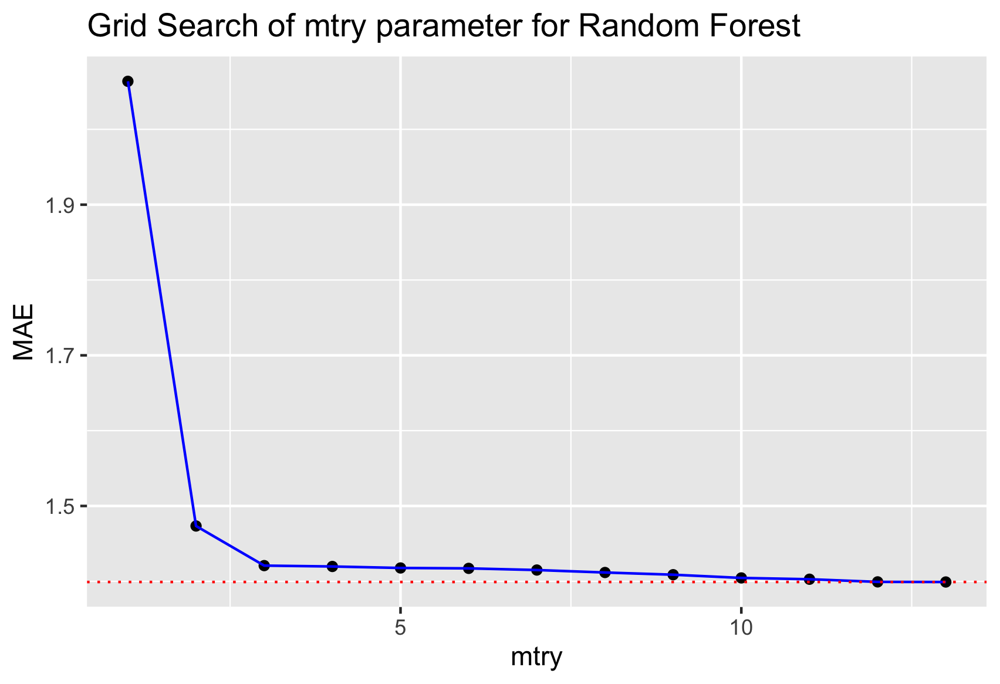
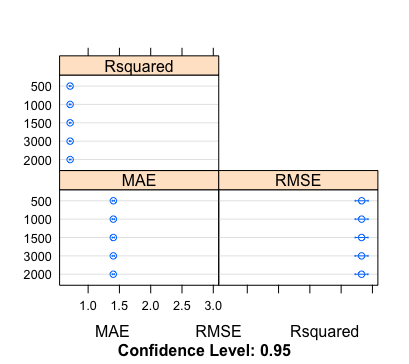
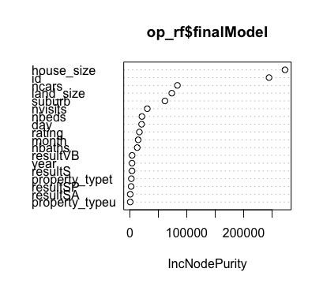

```{r setup, include = FALSE}
# The README markdown generate by this rmd file, please edit the content within this R markdown.

knitr::opts_chunk$set(
  collapse = TRUE,
  message = FALSE,
  error = FALSE,
  warning = FALSE,
  fig.path = "plot/",
  fig.align = "center",
  echo = FALSE
)
```

```{r}
# load library
library(tidyverse)

# MAE
MAE <- function(obs, pred) {
  e <- obs - pred
  mae <- mean(abs(e))
  return(mae)
}

# Import the spilt training data set
train_85 <- read_csv("data/train_85.csv")
train_15 <- read_csv("data/train_15.csv")
```

# Melbourne House Price Prediction

This repo is the summary of the previous work of Melbourne house price prediction, the data source can found in this competition [`vitticeps`](https://www.kaggle.com/c/vitticeps) in Kaggle.

### Modeling

In this competition I tried 3 tree-base models:

* Decision Tree

* Random Forest

* Gradient Boosting

#### Decision Tree

The first type of model we builded is Decision Tree using the package `rpart`. 

Source code `model_decision_tree.R` under `model` folder.

This model has a small cp allowed to grown a deep tree, then setting minspilt as 70. The node at least to have 70 samples to continue splitting, in order to reduce overfitting.  

```{r dt_model_visul}
dt <- readRDS("model/saved_model/dt_base.RDS")
plot(dt)
```

That is 751 end leaves, that is 751 prediction value for 32202 training samples.

```{r}
NROW(dt$y)
dt$frame %>%
  filter(var == "<leaf>") %>%
  nrow()
```

The size of samples in the end leaves between 23 to 69.

```{r size_endleaf_dt}
dt$frame %>%
  filter(var == "<leaf>") %>%
  ggplot(aes(x = n)) +
  geom_bar() +
  xlab("sample size") +
  ggtitle("Count of sample size in the end leaf in Decision Tree model")
```

Variable importance:

```{r}
dt$variable.importance
```

The result of this decision tree model suggested variables `house_size`, `id` and `suburb` are the top 3 affecting factors of the Melbourne house price.

```{r}
MAE(predict(dt, train_15), train_15$price)
```

The Mean Absoult Error (MAE) of the local test set is `1.216002`, it estimated the average error in out of sample prediction for Melboure house price is `AUD121,600.2`

#### Random Forest

The second type of model we builded is Random Forest using the package `randomForest` and parameters tunning using package `caret`.

Source code `model_random_forest.R` under `model` folder.

##### Parameters tunning

First we tuned the `mtry` between 1 to 13 base on 500 trees, with 5-fold cross validation and repeat 2 times. `mtry` is the number of variables to consider in each split.

The MAE of each parameter is:

{width="55%" height="20%"}

It suggested the optimise `mtry` base on 500 tree is 13

Then we tuned the parameter `ntree` base on `mtry = 13` on this sequence of tree: `500, 1000, 1500, 2000, 3000`, with 5-fold cross validation and repeat 2 times.. `ntree` is the number of trees to grow.

The plot of tunning result is:



The summary of the tunning result is:

```{r}
readRDS( "model/saved_message/rf_grid_ntree_error_RDS")
```

Base on the median MAE and mean MAE, it suggested `ntree = 2000`

Base on grid search, the optimised parameters for fitting random forest model in this dataset is `mtry = 13, ntree = 2000`.

The variable imporatance plot base on the optimise Random Forest model is:



It suggested the top affecting 3 factors for melbourne house price in this model is `house_size`, `id`, `ncars`.

The Mean Absoult Error (MAE) of the local test set is `1.334874`, it estimated the average error in out of sample prediction for Melboure house price is `AUD133,487.4`.

#### Gradient Boosting


