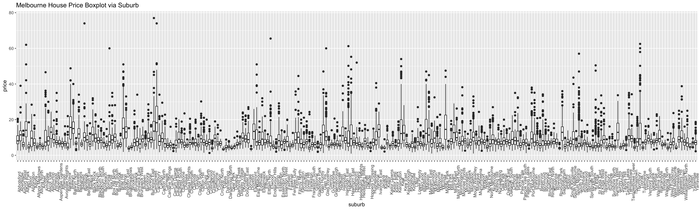

```{r setup, include = FALSE}
# The README markdown generate by this rmd file, please edit the content within this R markdown.

knitr::opts_chunk$set(
  collapse = TRUE,
  message = FALSE,
  error = FALSE,
  warning = FALSE,
  echo = FALSE,
  fig.path = "plot/",
  fig.align = "center",
  fig.width = 6,
  fig.height = 4,
  echo = FALSE
)
```

```{r library}
library(tidyverse)
library(brotools)
```

# Melbourne House Price Prediction - Report

### Data Files

* [`README.Rmd`](https://github.com/Jiaying-Wu/Melbourne-House-Price-Prediction/blob/master/report/README.Rmd): R markdown to generate this data insight of Melbourne house price data.

## Report

```{r data}
train <- read_csv("../data/train.csv")
test <- read_csv("../data/test_noprice.csv")
```

In this project we have `37,747` sale records with `14` features in training set, our goal is to develop a tool to predict the house price for `37,620` sale records in test set.

#### Label

`price`: price house sold for in AUD dollars, divided by 100,000.

```{r plot_price}
median_price <- median(train$price)
train %>%
  ggplot(aes(x = price)) +
  geom_density(color = "lightblue") +
  geom_vline(xintercept = median_price, color = "red") +
  geom_text(aes(x = median_price+1, y = 0, label = median_price), color = "red") +
  theme_blog() +
  ggtitle("Density Plot of Melbourne House Price")
```

The median house price in Melbourne is 720,000, most of the house price less than 2 millions. However, the disribution is right skewed, it might implied some of the record might belongs to luxury house.


### Features

##### 1.`id`: unique id for property.

```{r plot_id}
train %>%
  ggplot(aes(x = id, y = price, color = property_type)) +
  geom_point(alpha = 0.1) +
  theme_blog() +
  ggtitle("Melbourne House Price versus ID")
```

Clusters occured via `id` variable.

##### 2.`suburb`: suburb location of property.

```{r plot_suburb}
plot_suburb <- train %>%
  ggplot(aes(x = suburb, y = price)) +
  geom_boxplot() +
  theme(axis.text.x = element_text(angle = 90)) +
  ggtitle("Melbourne House Price Boxplot via Suburb")
#ggsave(plot = plot_suburb, filename = "plot/plot_suburb.png", height = 6, width = 20)
```



Variation occured via `suburb` variable, implied `suburb` is an important index for house price.

##### 3.`result`: `S` indicates property sold; `SP` - property sold prior; `PI` - property passed in; `PN` - sold prior not disclosed; `SN` - sold not disclosed; `NB` - no bid; `VB` - vendor bid; `o res` - other residential; `w` - withdrawn prior to auction.

```{r plot_result}
train %>%
  ggplot(aes(x = result, y = price, color = result, fill = result)) +
  geom_jitter(alpha = 0.1, width = 0.3) +
  stat_summary(fun = "mean", geom = "crossbar", color = "red") +
  theme_blog() +
  ggtitle("Melbourne House Price Violin Plot via Result")
```

The plot suggested `result` might not affect the house price in Melbourne, only a few properties sold by `SA`.

##### 4.`rating`

```{r plot_rating}
train %>%
  ggplot(aes(x = rating, y = price)) +
  geom_jitter(alpha = 0.1, width = 0.3,color = "lightblue") +
  geom_smooth(color = "red") +
  theme_blog() +
  ggtitle("Melbourne House Price Violin Plot via Rating")
```

The plot suggested `rating` might not affect the house price in Melbourne.

##### 5.`nbeds`: number of bedrooms.

```{r plot_nbeds}
train %>%
  ggplot(aes(x = nbeds, y = price)) +
  geom_jitter(alpha = 0.1, width = 0.3,color = "lightgreen") +
  geom_smooth(method = "glm") +
  stat_summary(fun = "mean", geom = "crossbar", color = "red") +
  theme_blog() +
  ggtitle("Melbourne House Price via Number of Bedrooms")
```

The plot suggested the house price in melbourne is positive associate with the number of bedrooms. The price dropping after 6 bedrooms, however not enought records to support this assumption.

##### 6.`property_type`: `h` = house, `t` = townhouse, `u` = unit/apartment.

```{r plot_property_type}
train %>%
  ggplot(aes(x = property_type, y = price, fill = property_type, color = property_type)) +
  geom_violin() +
  stat_summary(fun = "mean", geom = "crossbar", color = "red") +
  theme_blog() +
  ggtitle("Melbourne House Price via Number of Bedrooms")
```

In general, the mean house price in Melbourne is `house > townhouse > unit/apartment`. `unit/apartment` price much centralize in 250,000 to 750,000, `house` price spread out in a large range, less luxury property in `townhourse`.

##### 7.`day`: day of the month of auction.

```{r plot_day}
train %>%
  ggplot(aes(x = day, y = price)) +
  geom_jitter(alpha = 0.1, width = 0.3,color = "orange") +
  #stat_summary(fun = "mean", geom = "crossbar", color = "red") +
  geom_smooth(color = "blue") +
  theme_blog() +
  ggtitle("Melbourne House Price via Day in Month")
```

The plot suggest the Day in Month not affect the house price in Melbourne.

##### 8.`month`: month of auction.

```{r plot_month}
train %>%
  ggplot(aes(x = month, y = price)) +
  geom_jitter(alpha = 0.2, width = 0.3,color = "purple") +
  stat_summary(fun = "mean", geom = "crossbar", color = "red") +
  theme_blog() +
  ggtitle("Melbourne House Price via Month")
```

The house price in `January` and `July` is lower than the price in other months, however, only a few sale records in `January`.

##### 9.`year`: year of auction.

```{r plot_year}
train %>%
  ggplot(aes(x = year, y = price)) +
  geom_jitter(alpha = 0.1, width = 0.3,color = "yellow") +
  geom_smooth(method = "lm") +
  theme_blog() +
  ggtitle("Melbourne House Price via Year")
```

The plot suggested the house price was increasing along with `year` increased.

##### 10.`nvisits`: How many people came to open houses.

```{r plot_nvisits}
train %>%
  ggplot(aes(x = nvisits, y = price)) +
  geom_point(alpha = 0.1,color = "red") +
  geom_smooth() +
  theme_blog() +
  ggtitle("Melbourne House Price via Number of Visitors")
```

The plot suggested the house price is not associated with the number of people came to open houses.

##### 11.`ncars`: Number of parking places.

```{r plot_ncars}
train %>%
  ggplot(aes(x = ncars, y = price)) +
  geom_jitter(alpha = 0.1, width = 0.3,color = "pink") +
  stat_summary(fun = "mean", geom = "crossbar", color = "blue") +
  theme_blog() +
  ggtitle("Melbourne House Price via Number of Parking Places")
```

The plot suggested the house with 2 parking places would sold in a higher price.

##### 12.`nbaths`: Number of bathrooms.

```{r plot_nbaths}
train %>%
  ggplot(aes(x = nbaths, y = price)) +
  geom_jitter(alpha = 0.1,width = 0.1, color = "gold") +
  geom_smooth(method = "lm") +
  theme_blog() +
  ggtitle("Melbourne House Price via Number of Bathrooms")
```

The plot suggested the house price in melbourne is positive associate with the number of bathrooms.


##### 13.`land_size`: Size of the lot, in sq m, units will be 0.

```{r plot_land_size}
train %>%
  filter(land_size != 0) %>%
  ggplot(aes(x = land_size, y = price, color = property_type)) +
  geom_point(alpha = 0.1,width = 0.1) +
  geom_smooth(se = FALSE, color = "red") +
  theme_blog() +
  ggtitle("Melbourne House Price via Land size")
```

In general, the plot suggested land size of townhouse is smaller than house. 

The auction price is positive associate with the land size in house. 

However, unusual price fluctuation in townhouse.

```{r plot_land_size_t}
train %>%
  filter(land_size != 0) %>%
  filter(property_type == "t") %>%
  ggplot(aes(x = land_size, y = price)) +
  geom_point(alpha = 0.1, width = 0.1 , color = "lightblue") +
  geom_smooth(se = FALSE, color = "red") +
  theme_blog() +
  ggtitle("Melbourne House Price via Land size in Townhouse")
```

However, only keeping records for townhouse, it suggested that price of townhouse is not associated with the number of bathrooms. Fluctuation caused by unexpectd increasing price in land size around 200 to 210 squared meters.

##### 14.`house_size`: Internal size of property in sq m.

```{r plot_house_size}
train %>%
  ggplot(aes(x = house_size, y = price, color = property_type)) +
  geom_point(alpha = 0.1,width = 0.1) +
  geom_smooth(se = FALSE, color = "red") +
  theme_blog() +
  ggtitle("Melbourne House Price via Land size")
```

The plot auction price is positive associate with the house size

House size of townhouse centralize in 160 to 210 squared meters, house size for unit/apartment culsters in less than 100, 100 to 125, 150 and 250 squared meters. Size of house spread out from 100 to 500 squared meter.


