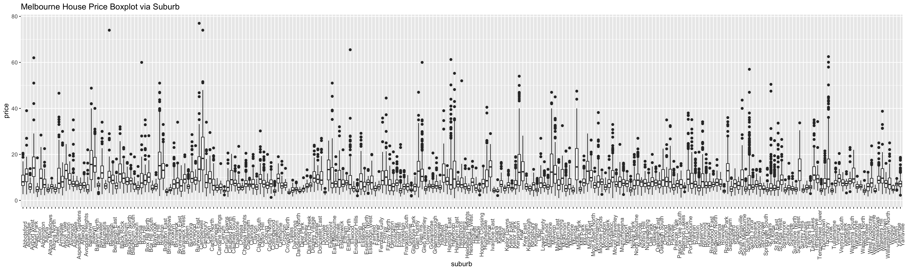
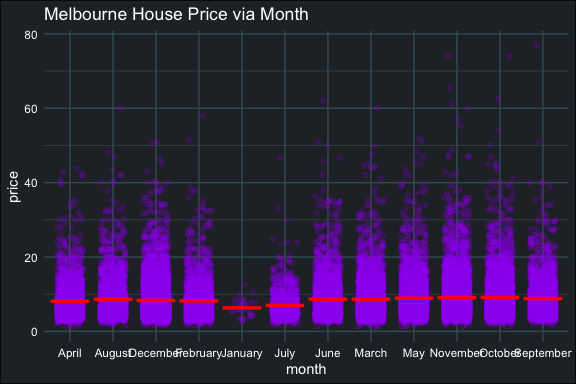

Melbourne House Price Prediction - Report
=========================================

### Data

In this project we have `37,747` sale records with `14` features in training set, our goal is to develop a tool to predict the house price for `37,620` sale records in test set.

#### Label

`price`: price house sold for in AUD dollars, divided by 100,000.

The median house price in Melbourne is 720,000, most of the house price less than 2 millions. However, the disribution is right skewed, it might implied some of the record might belongs to luxury house.

### Features

##### 1.`id`: unique id for property.

Clusters occured via `id` variable.

##### 2.`suburb`: suburb location of property.

Variation occured via `suburb` variable, implied `suburb` is an important index for house price.

##### 3.`result`: `S` indicates property sold; `SP` - property sold prior; `PI` - property passed in; `PN` - sold prior not disclosed; `SN` - sold not disclosed; `NB` - no bid; `VB` - vendor bid; `o res` - other residential; `w` - withdrawn prior to auction.

The plot suggested `result` might not affect the house price in Melbourne, only a few properties sold by `SA`.

##### 4.`rating`

The plot suggested `rating` might not affect the house price in Melbourne.

##### 5.`nbeds`: number of bedrooms.

The plot suggested the house price in melbourne is positive associate with the number of bedrooms. The price dropping after 6 bedrooms, however not enought records to support this assumption.

##### 6.`property_type`: `h` = house, `t` = townhouse, `u` = unit/apartment.

In general, the mean house price in Melbourne is `house > townhouse > unit/apartment`. `unit/apartment` price much centralize in 250,000 to 750,000, `house` price spread out in a large range, less luxury property in `townhourse`.

##### 7.`day`: day of the month of auction.

The plot suggest the Day in Month not affect the house price in Melbourne.

##### 8.`month`: month of auction.

The house price in `January` and `July` is lower than the price in other months, however, only a few sale records in `January`.

##### 9.`year`: year of auction.

The plot suggested the house price was increasing along with `year` increased.

##### 10.`nvisits`: How many people came to open houses.

The plot suggested the house price is not associated with the number of people came to open houses.

##### 11.`ncars`: Number of parking places.

The plot suggested the house with 2 parking places would sold in a higher price.

##### 12.`nbaths`: Number of bathrooms.

The plot suggested the house price in melbourne is positive associate with the number of bathrooms.

##### 13.`land_size`: Size of the lot, in sq m, units will be 0.

In general, the plot suggested land size of townhouse is smaller than house.

The auction price is positive associate with the land size in house.

However, unusual price fluctuation in townhouse.

However, only keeping records for townhouse, it suggested that price of townhouse is not associated with the number of bathrooms. Fluctuation caused by unexpectd increasing price in land size around 200 to 210 squared meters.

##### 14.`house_size`: Internal size of property in sq m.

The plot auction price is positive associate with the house size

House size of townhouse centralize in 160 to 210 squared meters, house size for unit/apartment culsters in less than 100, 100 to 125, 150 and 250 squared meters. Size of house spread out from 100 to 500 squared meter.
